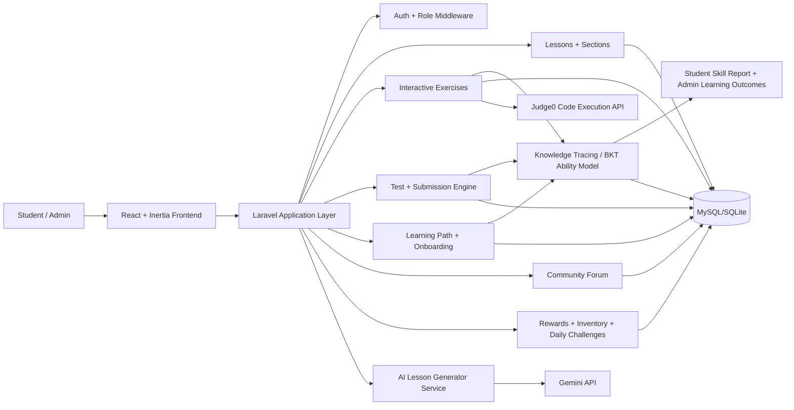

# CodeLearn — Web-Based Python Bootcamp (FYP)

A full-stack web learning platform for beginner-to-intermediate Python learners.
Built with Laravel + Inertia + React, combining a Bayesian knowledge-tracing ability model, AI-assisted lesson generation, concept-tagged placement testing, gamified exercises, and community discussion.

## 1. Problem Statement
Beginner programmers commonly face three issues:
- Learning paths are not personalized to their current skill level.
- Practice systems deliver content but rarely measure what the learner actually knows — a score on a test says little about which concepts are weak.
- Instructors/admins spend too much time creating and updating course content.

This project addresses these by combining:
- A per-concept ability model that updates from every answer the student gives.
- Placement-test-driven onboarding and path recommendation.
- Gamified learning loops (exercises, daily challenges, points, rewards, inventory).
- AI-assisted lesson authoring for administrators.

## 2. Project Objectives
- Build an end-to-end Python learning platform for students and administrators.
- Provide structured lessons, interactive practice, and assessments.
- Model each student's mastery per concept, and report measurable learning gain.
- Support adaptive onboarding and learning path enrollment.
- Improve student motivation through gamification.
- Reduce content authoring effort with AI-generated lesson drafts.

## 3. System Architecture


## 4. Core Innovation Highlights

### 4.1 Bayesian Knowledge Tracing ability model
The platform does not just record scores — it maintains `P(student knows concept)` for every
(student, concept) pair, using the four-parameter BKT model (Corbett & Anderson, 1995).

- Questions and interactive exercises are tagged with **concepts** (`loops`, `functions`, …), each with a weight expressing how central the concept is to that item.
- After each answered item, the estimate is revised in two steps: a **Bayes evidence step** that accounts for *slip* (knew it, answered wrong) and *guess* (didn't know it, answered right), then a **learning step** that adds the chance the practice opportunity itself taught them.
- `P(guess)` is question-type aware: a correct true/false answer is weak evidence, a correct coding answer is strong evidence.
- The estimate at placement time is snapshotted as `initial_mastery` and never updated, so the gap between it and current mastery is a **measurable learning gain**.

Design note: `BktEngine` is deliberately pure — no database, no request, no Eloquent — so the model is unit-testable in isolation. Persistence lives in `ConceptMasteryService`, evidence extraction in `EvidenceCollector`, and reporting in the read-only `MasteryAnalyticsService`. Tunable parameters live in `config/mastery.php`.

### 4.2 Concept-tagged placement test
New learners take a Python placement test whose questions are concept-tagged, so onboarding
seeds the ability model directly rather than producing only a single band/level.

### 4.3 AI lesson generation workflow
- Admin provides topic, difficulty, and optional video URL.
- System generates structured JSON lesson content with sections.
- Admin reviews/edits and saves as draft or publishes.
- Generation routes are rate-limited, and the service degrades gracefully when no API key is set.

### 4.4 Gamified learning model
Points and lifetime XP (level derived from lifetime XP), rewards, inventory/equipment,
daily challenges with streak milestones and full-clear bonuses, leaderboard, and community participation.

### 4.5 Multi-role platform design
Clear student/admin workflows across content, progress, analytics, and moderation.

## 5. Main Modules
- Authentication and role management (incl. password reset, OTP)
- Lessons and lesson sections
- Interactive exercises (coding, drag-drop, maze, adventure, fill-in-the-blank, simulation), with an optional live Monaco editor
- Tests, questions, and submissions
- **Knowledge tracing**: concept taxonomy, concept tagging, ability model, student skill report, admin learning-outcomes dashboard
- Learning paths, onboarding, and student progress tracking
- Daily challenges, missions, and leaderboard
- Forum and report moderation
- Rewards, inventory, and notifications
- Admin dashboard and management tools
- AI logs and AI-generated lesson management
- PWA install support (installable to a phone home screen, with an offline fallback page)

## 6. Tech Stack
- **Backend**: Laravel 12 (PHP 8.2+), Eloquent ORM, Inertia 2, Sanctum
- **Frontend**: React 19, Vite 7, Tailwind CSS, Monaco Editor, Heroicons/Lucide, Ziggy
- **Database**: SQLite (default local setup), MySQL-compatible schema
- **Queue**: database driver (mastery updates are dispatched off the request path)
- **AI**: Gemini API (`google-gemini-php/laravel`, default model `gemini-2.5-flash`)
- **Code execution**: Judge0 CE (Python 3)
- **Reporting**: PhpSpreadsheet export
- **Testing**: PHPUnit (backend), Vitest + Testing Library (frontend units), Playwright (E2E)
- **Deployment**: Docker, Render

## 7. Screenshots (For Report / Demo)
Place screenshots under `docs/screenshots/` (directory not yet created) and update the paths below:

- Landing page
  ``
- Student dashboard
  ``
- Lesson detail and progress
  ``
- Interactive exercise gameplay
  ``
- Placement test / onboarding
  ``
- Student skill report (per-concept mastery)
  ``
- Admin learning-outcomes dashboard
  ``
- Admin AI lesson generator
  ``
- Learning path management
  ``
- Rewards and inventory
  ``

## 8. Local Setup and Deployment
### 8.1 Prerequisites
- PHP 8.2+
- Composer
- Node.js 18+
- npm
- SQLite or MySQL

### 8.2 Installation
```bash
# 1) Clone repository
git clone <your-repo-url>
cd WBLSFB

# 2) Install backend dependencies
composer install

# 3) Install frontend dependencies
npm install

# 4) Configure environment
cp .env.example .env
php artisan key:generate

# 5) Prepare database (SQLite default)
# Make sure database/database.sqlite exists
php artisan migrate --seed

# 6) Run development services
composer run dev
```

### 8.3 Run Backend and Frontend Separately (Optional)
```bash
php artisan serve
npm run dev
```

### 8.4 Production Build
```bash
npm run build
php artisan config:cache
php artisan route:cache
php artisan view:cache
```

### 8.5 Deploy to Render (Docker)
The repo ships a `Dockerfile` and `render-build.sh` for a containerized deploy.
See **[docs/DEPLOY-RENDER.md](docs/DEPLOY-RENDER.md)** for the full walkthrough.

## 9. Required Environment Variables
Set these in `.env` for your environment (see `.env.example` for the full list):

| Variable | Purpose |
|---|---|
| `APP_NAME`, `APP_ENV`, `APP_DEBUG`, `APP_URL` | Core app config. `APP_NAME` also drives the PWA manifest name. |
| `DB_CONNECTION`, `DB_DATABASE` (or MySQL credentials) | Database |
| `QUEUE_CONNECTION`, `SESSION_DRIVER`, `CACHE_STORE` | Default to `database` |
| `GEMINI_API_KEY` | AI lesson generation. Optional — the feature degrades gracefully without it. |
| `GEMINI_MODEL` | Defaults to `gemini-2.5-flash` |
| `JUDGE0_API_URL`, `JUDGE0_API_KEY` | Code execution for coding exercises |
| `JUDGE0_API_HOST`, `JUDGE0_LANGUAGE_ID` | Optional overrides (default Python 3, id `71`) |
| `BKT_P_INIT`, `BKT_P_TRANSIT`, `BKT_P_SLIP` | Optional BKT tuning; sensible defaults in `config/mastery.php` |
| Mail/storage settings | As required by your deployment |

## 10. Testing Status
Snapshot date: **September 18, 2026** — all checks run on this commit.

| Check | Command | Result |
|---|---|---|
| Backend test suite | `php artisan test` | **297 passed** (1003 assertions, 22.8s) |
| Frontend unit tests | `npm run test:unit` | **41 passed** (8 files) |
| Production build | `npm run build` | **Built successfully** (21.2s) |

Test coverage includes dedicated suites for the knowledge-tracing layer
(`ConceptMasteryServiceTest`, `ConceptTaggingTest`, `MasteryAnalyticsTest`,
`ConceptMasteryDispatchTest`, `PlacementMasteryDoubleCountTest`), the PWA install
contract (`PwaTest`), and a broken-page regression guard (`BrokenPageRegressionTest`).

End-to-end tests (8 Playwright specs, including a cross-page mobile responsiveness audit)
run separately and need a running server:
```bash
npm run test:e2e
```

## 11. High-Level Project Structure
```text
app/
  Http/Controllers/
  Models/
  Services/
    Mastery/          # BKT engine, tagging, evidence, analytics
config/
  mastery.php         # BKT parameters
  recommendation.php  # Learning path recommendation tuning
resources/js/
  Pages/
    Student/Mastery/  # Skill report
  Components/
routes/
  web.php
  api.php
database/
  migrations/
  seeders/
tests/
  Feature/
  Unit/
  e2e/                # Playwright specs
docs/
  DEPLOY-RENDER.md
```

## 12. Future Improvements
- Add CI pipeline (lint + unit/integration tests + build checks).
- Fit BKT parameters per concept from historical data instead of using global defaults.
- Use the ability model to drive adaptive item selection (serve the next question at the concept where the estimate is most uncertain).
- Extend analytics for retention and cohort comparison.
- Add stronger guardrails for AI-generated content validation.

## 13. License
This project is created for Final Year Project (academic use).
Add your preferred license if you plan to distribute publicly.
