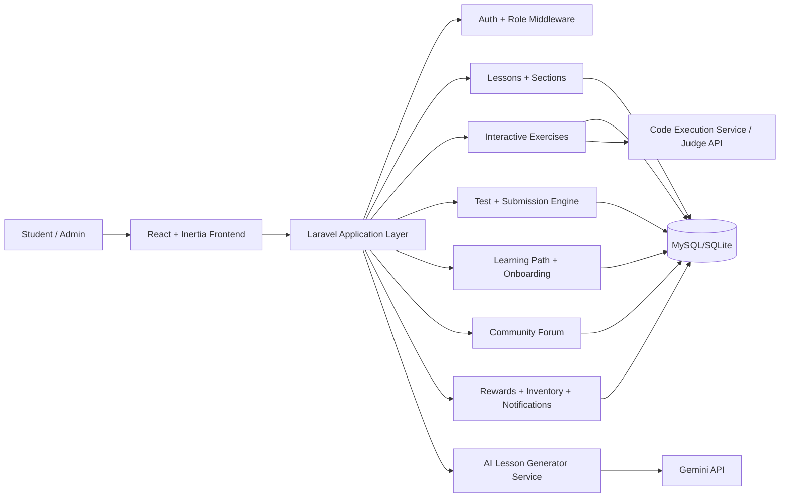

# Web-Based Python Bootcamp Project (FYP)

A full-stack web learning platform for beginner-to-intermediate Python learners.
Built with Laravel + Inertia + React, including AI-assisted lesson generation, adaptive onboarding, gamified exercises, tests, rewards, and forum discussion.

## 1. Problem Statement
Beginner programmers commonly face three issues:
- Learning paths are not personalized to their current skill level.
- Practice systems deliver content but often lack engagement.
- Instructors/admins spend too much time creating and updating course content.

This project addresses these by combining:
- Placement-test-driven onboarding and path recommendation.
- Gamified learning loops (exercises, points, rewards, inventory).
- AI-assisted lesson authoring for administrators.

## 2. Project Objectives
- Build an end-to-end Python learning platform for students and administrators.
- Provide structured lessons, interactive practice, and assessments.
- Support adaptive onboarding and learning path enrollment.
- Improve student motivation through gamification.
- Reduce content authoring effort with AI-generated lesson drafts.

## 3. System Architecture


## 4. Core Innovation Highlights
- AI lesson generation workflow:
  - Admin provides topic, difficulty, and optional video URL.
  - System generates structured JSON lesson content with sections.
  - Admin reviews/edits and saves as draft or publishes.
- Placement-test-based onboarding:
  - New learners are assessed and guided into suitable learning paths.
- Gamified learning model:
  - Points, rewards, inventory/equipment, completion feedback, and community participation.
- Multi-role platform design:
  - Clear student/admin workflows across content, progress, analytics, and moderation.

## 5. Main Modules
- Authentication and role management
- Lessons and lesson sections
- Interactive exercises (drag-drop, maze, adventure, coding, fill-in-the-blank, simulation)
- Tests, questions, and submissions
- Learning paths and student progress tracking
- Forum and report moderation
- Rewards, inventory, and notifications
- Admin dashboard and management tools
- AI logs and AI-generated lesson management

## 6. Tech Stack
- Backend: Laravel 12 (PHP 8.2+), Eloquent ORM, Inertia
- Frontend: React, Vite, Tailwind CSS
- Database: SQLite (default local setup), MySQL-compatible schema
- AI: Gemini API
- Tooling: PHPUnit, Laravel Artisan, Vite

## 7. Screenshots (For Report / Demo)
Place screenshots under `docs/screenshots/` and update the paths below:

- Landing page
  ``
- Student dashboard
  ``
- Lesson detail and progress
  ``
- Interactive exercise gameplay
  ``
- Placement test / onboarding
  ``
- Admin AI lesson generator
  ``
- Learning path management
  ``
- Rewards and inventory
  ``

## 8. Local Setup and Deployment
### 8.1 Prerequisites
- PHP 8.2+
- Composer
- Node.js 18+
- npm
- SQLite or MySQL

### 8.2 Installation
```bash
# 1) Clone repository
git clone <your-repo-url>
cd Web-Based-Python-Bootcamp-project

# 2) Install backend dependencies
composer install

# 3) Install frontend dependencies
npm install

# 4) Configure environment
cp .env.example .env
php artisan key:generate

# 5) Prepare database (SQLite default)
# Make sure database/database.sqlite exists
php artisan migrate --seed

# 6) Run development services
composer run dev
```

### 8.3 Run Backend and Frontend Separately (Optional)
```bash
php artisan serve
npm run dev
```

### 8.4 Production Build
```bash
npm run build
php artisan config:cache
php artisan route:cache
php artisan view:cache
```

## 9. Required Environment Variables
Set these in `.env` for your environment:
- `APP_NAME`, `APP_ENV`, `APP_DEBUG`, `APP_URL`
- `DB_CONNECTION`, `DB_DATABASE` (or MySQL credentials)
- `QUEUE_CONNECTION`, `SESSION_DRIVER`, `CACHE_STORE`
- `GEMINI_API_KEY` (if mapped in `config/services.php`)
- Mail/storage settings required by your deployment setup

## 10. Testing Status (Snapshot)
Snapshot date: **April 22, 2026**

Verified:
- PHP syntax checks on modified backend files: **Passed**
- Critical route registration checks (`admin/ai-lessons`, `test-gemini`): **Passed**
- AI lesson hardening updates applied:
  - safer error responses
  - progress recalculation trigger fix
  - graceful handling when API key is missing

Known environment constraints during this snapshot:
- `php artisan test` was blocked by a local cwd/runtime path issue.
- `npm run build` failed in this environment due to local process permission (`spawn EPERM`), not a confirmed app logic failure.

Recommended final checks:
```bash
php artisan test
npm run build
```

## 11. High-Level Project Structure
```text
app/
  Http/Controllers/
  Models/
  Services/
resources/js/
  Pages/
  Components/
routes/
  web.php
  api.php
database/
  migrations/
  seeders/
```

## 12. Future Improvements
- Add CI pipeline (lint + unit/integration tests + build checks).
- Unify duplicated frontend dependency versions.
- Extend analytics for learning outcomes and retention.
- Add stronger guardrails for AI-generated content validation.

## 13. License
This project is created for Final Year Project (academic use).
Add your preferred license if you plan to distribute publicly.
